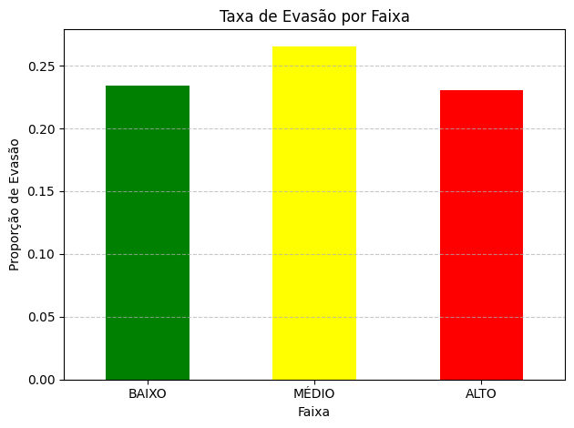

# 📊 Análise Preditiva de Risco de Evasão Escolar

## 📌 Problema
A evasão escolar impacta diretamente instituições de ensino, reduzindo receita e prejudicando indicadores acadêmicos.

## 🎯 Objetivo
Desenvolver um modelo de **Score de Risco de Evasão** para identificar alunos com maior probabilidade de abandono e permitir ações preventivas.

---

## 🛠️ Tecnologias
- Python (Pandas, Matplotlib)
- SQL (extração de KPIs)
- Excel (base de dados)

---

## 🔄 Etapas do Projeto
1. Limpeza e tratamento de dados  
2. Análise exploratória  
3. Criação de score de risco  
4. Segmentação de alunos por risco  
5. Geração de visualizações  

---

## 📉 Principais Insights
- Alunos com **baixo score (<400)** apresentam maior taxa de evasão  
- É possível identificar padrões de risco antecipadamente  
- Dados podem ser usados para ações de retenção  

---

## 📊 Visualização

---

## 🚀 Resultado
O projeto permite identificar alunos com alto risco de evasão, possibilitando intervenções estratégicas para melhorar a retenção.

---

## 📁 Estrutura do Projeto

data/ → dados utilizados  
src/ → scripts em Python  
sql/ → consultas SQL  
imagens/ → gráficos e resultados

---

## 👨‍💻 Autor
Bruno Freitas de Souza  
Estudante de Data Science
